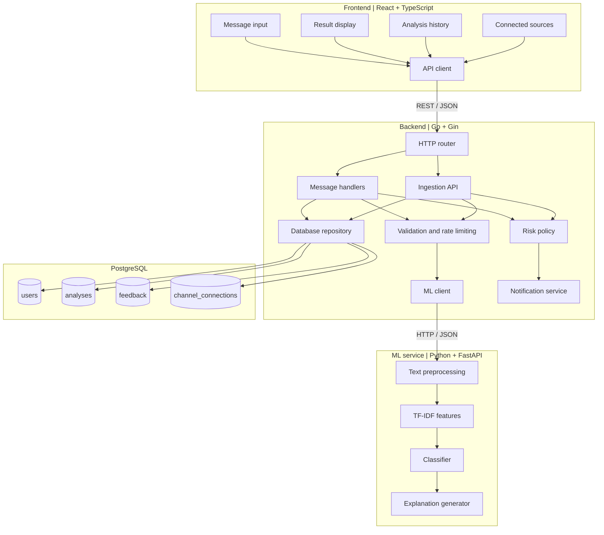

# FraudGuard Component Diagram

```mermaid
flowchart TB
    subgraph frontend["Frontend | React + TypeScript"]
        input[Message input]
        result[Result display]
        history[Analysis history]
        sources[Connected sources]
        client[API client]
        input --> client
        result --> client
        history --> client
        sources --> client
    end

    subgraph backend["Backend | Go + Gin"]
        router[HTTP router]
        handlers[Message handlers]
        ingest[Ingestion API]
        validate[Validation and rate limiting]
        mlclient[ML client]
        policy[Risk policy]
        notify[Notification service]
        repository[Database repository]
        router --> handlers
        router --> ingest
        handlers --> validate
        ingest --> validate
        validate --> mlclient
        handlers --> policy
        ingest --> policy
        policy --> notify
        handlers --> repository
        ingest --> repository
    end

    subgraph inference["ML service | Python + FastAPI"]
        preprocess[Text preprocessing]
        features[TF-IDF features]
        classifier[Classifier]
        explain[Explanation generator]
        preprocess --> features --> classifier --> explain
    end

    subgraph database["PostgreSQL"]
        users[(users)]
        analyses[(analyses)]
        feedback[(feedback)]
        connections[(channel_connections)]
    end

    client -->|REST / JSON| router
    mlclient -->|HTTP / JSON| preprocess
    repository --> users
    repository --> analyses
    repository --> feedback
    repository --> connections
```
