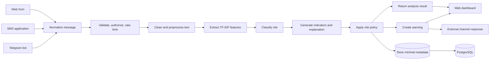

# FraudGuard Data Flow

```mermaid
flowchart LR
    web[Web form]
    sms[SMS application]
    telegram[Telegram bot]
    normalize[Normalize message]
    validate[Validate, authorize, rate-limit]
    preprocess[Clean and preprocess text]
    features[Extract TF-IDF features]
    model[Classify risk]
    explain[Generate indicators and explanation]
    policy[Apply risk policy]
    result[Return analysis result]
    warning[Create warning]
    metadata[(Store minimal metadata)]
    dashboard[Web dashboard]
    channel[External channel response]

    web --> normalize
    sms --> normalize
    telegram --> normalize
    normalize --> validate --> preprocess --> features --> model --> explain --> policy
    policy --> result --> dashboard
    policy --> warning
    policy --> metadata
    warning --> dashboard
    warning --> channel
    metadata --> db[(PostgreSQL)]
```
