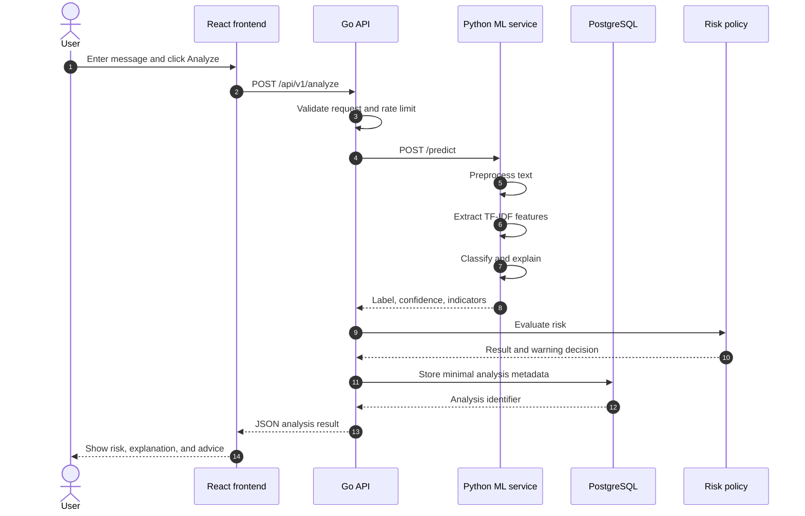

# FraudGuard Analysis Sequence

```mermaid
sequenceDiagram
    autonumber
    actor User
    participant Web as React frontend
    participant API as Go API
    participant ML as Python ML service
    participant DB as PostgreSQL
    participant Notify as Risk policy

    User->>Web: Enter message and click Analyze
    Web->>API: POST /api/v1/analyze
    API->>API: Validate request and rate limit
    API->>ML: POST /predict
    ML->>ML: Preprocess text
    ML->>ML: Extract TF-IDF features
    ML->>ML: Classify and explain
    ML-->>API: Label, confidence, indicators
    API->>Notify: Evaluate risk
    Notify-->>API: Result and warning decision
    API->>DB: Store minimal analysis metadata
    DB-->>API: Analysis identifier
    API-->>Web: JSON analysis result
    Web-->>User: Show risk, explanation, and advice
```
